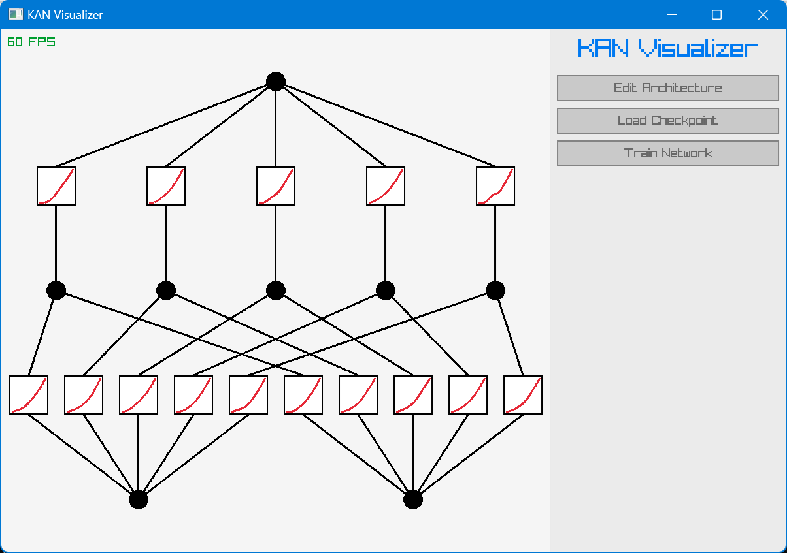

# ikant: Interactive Kolmogorov-Arnold Networks Toolkit

A simple C++ implementation and visualization of Kolmogorov-Arnold Networks.



## Features

- Implementation of Kolmogorov-Arnold Networks (KAN)
- Visualization of network structures and training processes
- GUI for editing network parameters and training settings
- Integration with LAPACK for numerical computations
- Integration with Raylib for graphical rendering

## Getting Started

### Prerequisites

- C++ compiler (supporting C++11 or later)
- Make
- LAPACK library
- Raylib library

### Building the Project

1. Clone the repository:

   ```sh
   git clone https://github.com/huytrinhm/ikant.git
   cd ikant
   ```

2. Build the project using Make:

   ```sh
   make
   ```

   You may need to modify the `Makefile` to specify the paths to the LAPACK and Raylib libraries. The files inside this repository `lib` directory is provided as a reference.

3. Download example checkpoint and data files from the [releases](https://github.com/huytrinhm/ikant/releases/tag/0.0.1) and place them into the project directory.

### Running the Application

After building the project, you can run the application using:

```sh
./main.exe
```

## Acknowledgements

- [pykan](https://github.com/KindXiaoming/pykan/tree/f6ac7e25ed4cd99aba2b9c883d1cf25f959f6ac4): The original Python implementation of Kolmogorov-Arnold Networks. The project at the linked commit was used as a reference for this C++ implementation.
- [efficient-kan](https://github.com/Blealtan/efficient-kan): An efficient implementation of Kolmogorov-Arnold Networks in Python. The project was used as a reference for the implementation of our C++ version.
- [An Introduction to Spline Theory (Michael S. Floater)](https://www.uio.no/studier/emner/matnat/math/MAT4170/v23/undervisningsmateriale/spline_notes.pdf): This document was used as a reference for the understanding of spline theory and the implementation of B-spline in this project.
- [Raylib](https://www.raylib.com/) for graphical rendering.
- [LAPACK](https://www.netlib.org/lapack/) for numerical computations.
- [TinyFileDialogs](https://sourceforge.net/projects/tinyfiledialogs/) for file dialogs.

## Contributing

Since this project is developed as a part of my personal research, I am not actively looking for contributions. However, feel free to fork the repository and make your own modifications.
